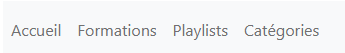

# Mediatekformation
## Lien vers le dépôt d'origine
 Vous pouvez retrouver le dépôt d'origine en cliquant sur ce lien: https://github.com/CNED-SLAM/mediatekformation .
 Dans le readme de ce dépôt se trouve l'application d'origine, ainsi que la présentation de l'application d'origine.

## Présentation des fonctionnalités ajoutées
 Dans cette partie, vous pourrez retrouver les fonctionnalités ajoutées à l'application.

### Nombre de formations par playlist + tri
 Dans la page des playlists, une nouvelle colonne a été ajoutée, ainsi que la possibilité d'effectuer 
un tri par ordre croissant ou décroissant sur cette nouvelle colonne.

### Connexion admin
 Il est possible de se connecter en tant qu'admin de façon sécurisée (grâce à KeyCloak) via le lien 
http://localhost/mediatekformation/public/admin/formations (en local), ou bien
https://mediatekformationugo.go.yj.fr/ (en ligne).

### Page admin de gestion des formations
 Une fois connecté en tant qu'admin, il est possible d'accéder à la page admin de gestion des
formations. Tous les tris et filtres présents sur la page des formations d'origine sont fonctionnels
sur cette page.

### Ajouter une formation 
 Il est possible d'ajouter une formation, à condition que toutes les informations marquées par un
astérisque (*) soient complétées et valides.

### Modifier une formation
 Il est possible de modifier une formation, à condition que toutes les informations marquées par un
astérisque (*) soient complétées et valides.

### Supprimer une formation
 Il est possible de supprimer une formation après confirmation. La formation sera alors supprimée
de la playlist auquelle elle appartenait.

### Page admin de gestion des playlits
 Une fois connecté en tant qu'admin, il est possible d'accéder à la page admin de gestion des
playlists. Tous les tris et filtres présents sur la page des playlists d'origine sont fonctionnels
sur cette page.

### Ajouter une playlist
 Il est possible d'ajouter une playlist, à condition que toutes les informations marquées par un
astérisque (*) soient complétées et valides (donc son nom).

### Modifier une playlist
 Il est possible de modifier une playlist, à condition que toutes les informations marquées par un
astérisque (*) soient complétées et valides (donc son nom).

### Supprimer une playlist
 Il est possible de supprimer une playlist après confirmation. Pour qu'une playlist soit
supprimable, celle-ci doit impérativement être vide.

### Page admin de gestion des catégories
 Une fois connecté en tant qu'admin, il est possible d'accéder à la page admin de gestion des
catégories.

### Ajouter une catégorie
 Il est possible d'ajouter une nouvelle catégorie via un mini-formulaire, en saisissant son nom.

### Supprimer une catégorie
 Il est possible de supprimer une catégorie après confirmation. Pour qu'une catégorie soit
supprimable, celle-ci doit impérativement être inutilisée.

### Déconnexion
 Sur chaque page admin, il est possible de se déconnecter via un bouton situé en haut à droite.
Il faudra alors saisir de nouveau les identifiants afin de pouvoir se reconnecter dans la partie
back-office.

### Menu admin
 Sur chaque paga admin, le menu a été adapté afin de faciliter la navigation:
 -Accueil -> Accès à la page d'accueil.
 -Formations -> Accès à la page admin de gestion des formations.
 -Playlists -> Accès à la page admin de gestion des playlists.
 -Catégories -> Accès à la page admin de gestion des catégories.

### Documentation technique
 Il est possible de consulter la documentation technique via le lien
http://localhost/mediatekformation/public/documentation/index.html (en local), ou bien
https://mediatekformationugo.go.yj.fr/documentation/index.html (en ligne).

### Vidéo de présentation des fonctionnalités
 Pour plus d'informations, il est possible de consulter cette vidéo, montrant toutes les
fonctinnalités de la nouvelle application: (lien de la vidéo).

### Accéder au site en ligne
 Il est possible d'accéder au site hébergé en ligne via ce lien: https://mediatekformationugo.go.yj.fr/ .

### Tutoriel d'installation de l'application
 1) Télécharger le zip de l'application.
 2) Après avoir installé et configuré Wamp64, lancer cette application.
 3) Dans le navigateur, accédez à la phpMyAdmin via l'adresse suivante: http://localhost/phpmyadmin .
 4) Extraire le zip dans un dossier "mediatekformation" au niveau du dossier "www" de votre installation de Wamp64 (par défaut: "C:\wamp64\www").
 5) Créer une nouvelle base de données "mediatekformation", et y importer le fichier "mediatekformation.sql" présent dans les fichiers dézippés.
 6) Ouvrir une console en mode administrateur, se placer dans le dossier du site (normalement: "C:\wamp64\www"), et exécuter la commande "composer install" afin de recréer le dossier "vendor".
 7) Après avoir installé et configuré KeyCloak, lancer cette application en tapant la commande "kc.bat start-dev" dans une console en mode administrateur depuis le dossier "bin" de votre installation de KeyCloak (par défaut: "C:\keycloak\bin").
 8) Accéder au site via le lien http://localhost/mediatekformation/public/ , à la partie admin via le lien http://localhost/mediatekformation/public/admin/formations , et à la documentation technique via le lien http://localhost/mediatekformation/public/documentation/index.html .

